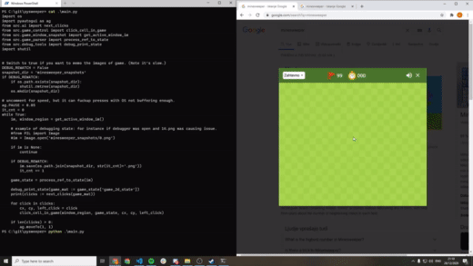

# PREVIEW

    

https://www.youtube.com/watch?v=uGO0jpTkNBI

# NOTE!

* this projects requires windows os and google chrome. (but can be changed to work on other platforms and / or browsers.)

**If using virtualenv COPY UIAutomationCore.dll from %windir%/System32 into "env" (virtualenv) folder**

---

run activate.bat to activate venv (you will have to init it thou with python -m venv env)

run ireq.bat to install requirements.

run run.bat to start program

---

This program requires minesweeper window to be active. And running on your primary display screen.